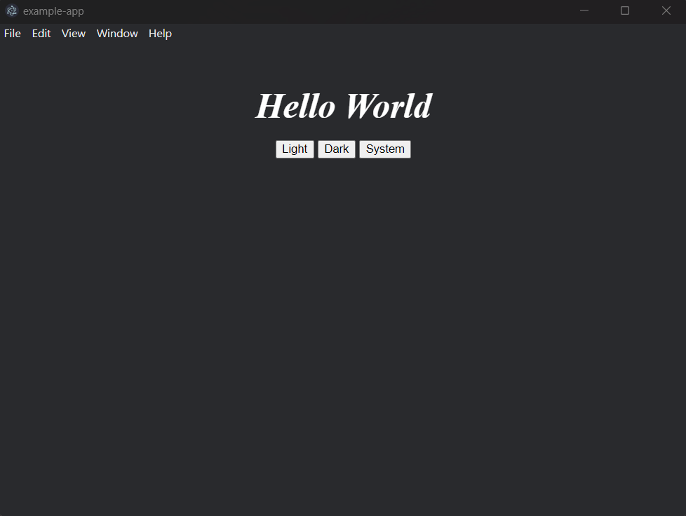

# electron-react-mastercss-template

Electron + React + MasterCSS



## Usage

Use degit to create a new project and install dependencies:

```bash
npx degit 0miles/electron-react-mastercss-template.git your-project-name
cd your-project-name
npm install
```

## Starting dev
Open two terminals and execute the following
```bash
npm run dev:vite
```

```bash
npm run dev:electron
```